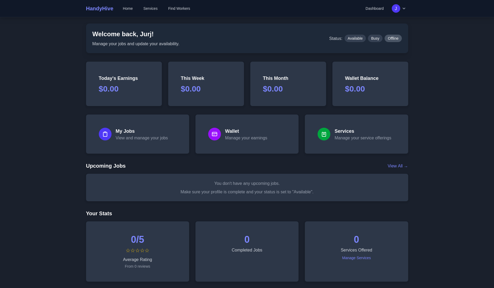
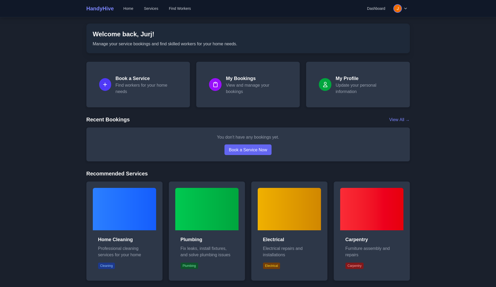
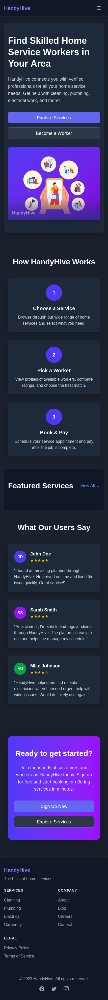

# HandyHive

**"The buzz of home services"**

HandyHive is a platform connecting customers with skilled home service workers. The application facilitates service bookings, worker discovery, and payment processing.

## Live Demo

🌐 [HandyHive Live Demo](https://handyhive-290624210240.us-central1.run.app/)

## Screenshots

### Worker Dashboard


### Customer Dashboard


### Mobile View


## Key Features

- **User Authentication**: Secure login and registration for customers and workers
- **Worker Profiles**: Detailed profiles with verification and ratings
- **Service Booking**: Intuitive booking system for home services
- **Location-Based Matching**: Find nearby service providers
- **In-App Wallet**: Manage earnings and transactions
- **Dashboard**: Track jobs, earnings, and bookings
- **Responsive Design**: Works on both desktop and mobile devices

## Technology Stack

### Frontend
- **Vue 3**: Progressive JavaScript framework
- **Vite**: Next-generation frontend tooling
- **Pinia**: State management
- **Tailwind CSS**: Utility-first CSS framework

### Backend
- **Firebase Authentication**: Email and Google sign-in
- **Firestore**: NoSQL database for user and service data
- **Cloud Storage**: File hosting for profile pictures and certificates

## Getting Started

### Prerequisites
- Node.js (version 16+)
- npm or yarn
- Firebase account

### Installation

1. Clone the repository
   ```bash
   git clone https://github.com/yourusername/handyhive.git
   cd handyhive
   ```

2. Install dependencies
   ```bash
   npm install
   ```

3. Set up environment variables
   ```bash
   cp .env.example .env
   ```
   
4. Update the `.env` file with your Firebase configuration

5. Run the development server
   ```bash
   npm run dev
   ```

## Environment Variables Setup

This project uses environment variables to manage Firebase configuration. To set up your environment:

1. Copy the `.env.example` file to a new file named `.env` or `.env.local`
2. Replace the placeholder values with your actual Firebase project configuration
3. The `.env.local` file is ignored by Git, so your sensitive information won't be committed

Example:
```
VITE_FIREBASE_API_KEY=your_actual_api_key
VITE_FIREBASE_AUTH_DOMAIN=your_project.firebaseapp.com
...
```

**Important Notes:**
- Vite requires environment variables to be prefixed with `VITE_` to be exposed to the client-side code
- Environment variables are accessed via `import.meta.env.VITE_VARIABLE_NAME` in the code
- You'll need to restart your development server after changing environment variables

## Deployment

The application is deployed on Google Cloud Run. To deploy your own instance:

1. Build the application
   ```bash
   npm run build
   ```

2. Deploy to Cloud Run using the Docker approach
   ```bash
   gcloud run deploy handyhive --source . --project your-project-id --platform managed --region us-central1 --allow-unauthenticated --env-vars-file env.yaml
   ```

## License

MIT © HandyHive
